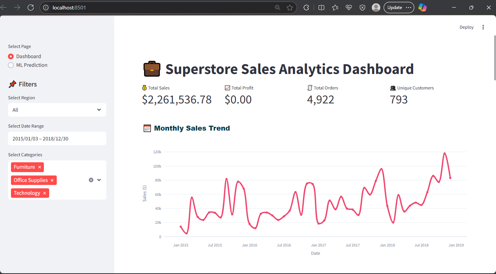
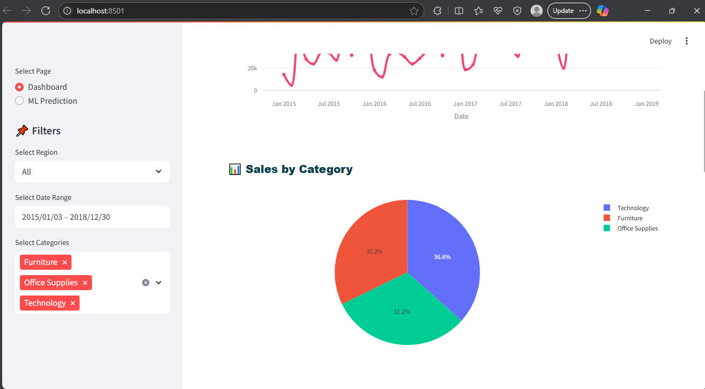
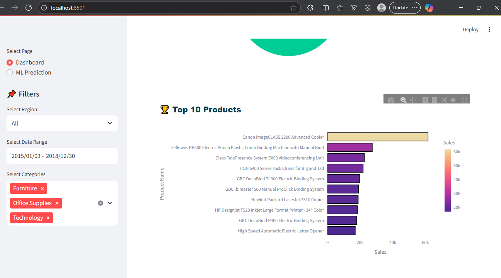
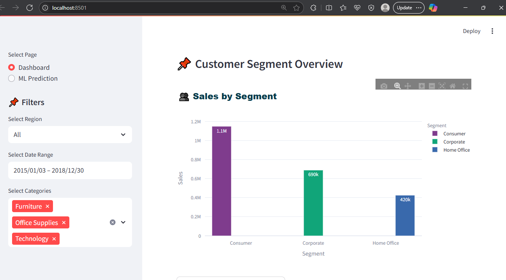
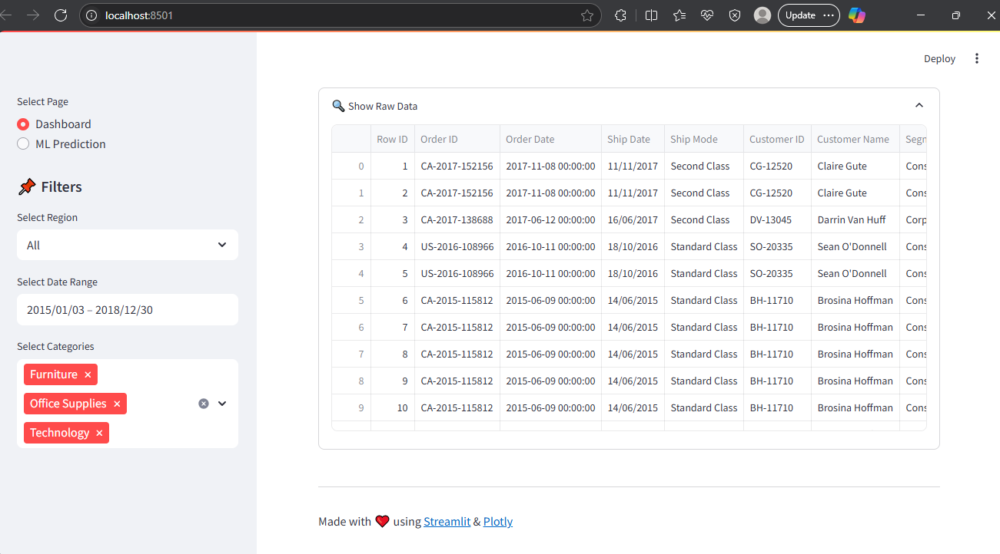
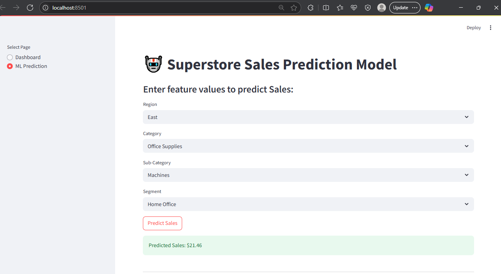

# 📊 Sales Data Analysis Dashboard

This project is an interactive **Sales Data Analysis Dashboard** built with **Streamlit**.  
It helps visualize sales trends, profits, and key metrics for better business insights.

---

## 🚀 Features

- 📈 Interactive sales charts and plots
- 📅 Filter by date range
- 🏷️ Analyze profit by category and region
- ⚡️ Real-time data updates
- Simple, modern UI with Streamlit

---

## 📸 Demo

Here’s what it looks like:









---

## 📂 Project Structure
```Sales-Data-Analysis/
│
├── dashboards/
│ └── app.py
├── data/
│ └── superstore.csv
├── env/
│ └── [virtual environment files]
├── images/
│ └── dashboard-1.png
│ └── dashboard-2.png
│ └── dashboard-3.png
│ └── dashboard-4.png
│ └── dashboard-5.png
│ └── dashboard-6.png
├── models/
│ └── sales_predictor_model.joblib
├── notebooks/
│ └── sales_analysis.ipynb
└── README.md
└── LICENSE
└── requirements.txt
```
---

## 🛠️ Setup Instructions

1️⃣ Clone the repo:


git clone  https://github.com/HayreKhan750/Sales-Data-Analysis.git
cd Sales-Data-Analysis


